# Overview
This workflow demonstrates an example of performing robust and relatively fast camera alignment (SfM) using omnidirectional images: Equirectangular (equidistant cylindrical projection) images, followed by training 3D Gaussian Splatting (3DGS). 
This workflow is a rewritten version of [[EN]Easy&Fast 3D Gaussian Splatting workflow with 360 Camera]([EN]Easy&Fast%203D%20Gaussian%20Splatting%20workflow%20with%20360%20Camera.md) that replaces Metashape-based camera alignment (SfM) with COLMAP. Please read it as well.

# References
Note: The examples below were created using Metashape, but similar results can be achieved with COLMAP.
### DJI AVATA360 examples
* https://x.com/kotohibi_3d/status/2079907663895482456
* https://x.com/kotohibi_3d/status/2040724840504758578
* https://x.com/naribubu/status/2038881884558791088
* https://x.com/naribubu/status/2038875398717722743
### DJI OSMO360 examples
* https://x.com/kotohibi_3d/status/2088521899160879450
* https://x.com/kotohibi_3d/status/2082426800215654725
* https://x.com/kotohibi_3d/status/2074821581948481758
* https://x.com/kotohibi_3d/status/2038179454367957106

# Requirements
* 360° Camera
    * DJI OSMO360
    * DJI AVATA360
    * Insta360

* High-end PC and NVIDIA GPU
    * Training 3DGS requires a high-performance GPU. In particular, more VRAM is better. I recommend a GPU with at least 12 GB of VRAM.

* COLMAP
  * Open-source software for camera alignment (SfM).
    * https://colmap.github.io/
  * It can directly perform SfM on omnidirectional images and is relatively robust and fast.
  * This workflow uses the latest version V4.2.0 at the time of writing. You can download it from:
    * https://github.com/colmap/colmap/tags
    * I recommend the binary (CUDA) edition **colmap-x64-windows-cuda.zip**.

* 3D Gaussian Splatting software
    * LichtFeld Studio (LFS): https://lichtfeld.io/
    * Postshot: https://www.jawset.com/
    * Brush: https://github.com/ArthurBrussee/brush
* Still-image extraction tool from video
    * Extract Sharpest Frame (free edition)
        * https://github.com/Kotohibi/Extract_sharpest_frame
    * 360 Extractor (paid edition)
        * https://kotohibi.f5.si/360/extractor.html
* Cubemap conversion tool for COLMAP 360 SfM results
    * 360 CCConverter (paid edition)
        * https://kotohibi.f5.si/360/ccconverter.html

# Video Shooting (e.g. OSMO360)
Attach the camera to a selfie stick and slowly walk through the area you want to capture.
Recommended video settings: D-Log M, 30 fps or higher.
# Develop the Video
### Import the captured data into DJI Studio and perform color grading (color restoration).
* Apply the settings inside the red frame in the image below.
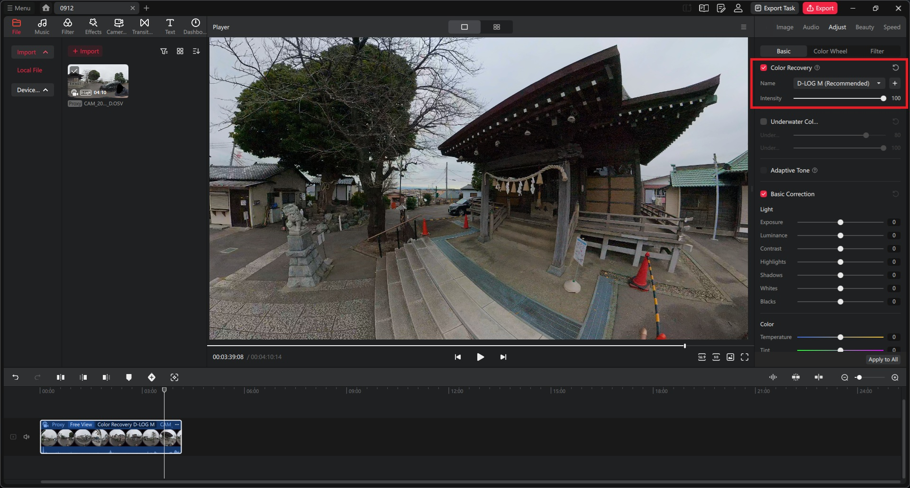

* (Advanced settings) When using the seam mask implemented in Extract Sharpest Frame V1.0.0 or later, turn RockSteady off. RockSteady provides electronic image stabilization and horizon leveling, but it changes the stitch line. Turn off the equivalent feature for Insta360 cameras as well.
    * (Note) The seam mask masks misalignments along the stitch line between the front and rear fisheye cameras, allowing that area to be excluded from the camera alignment and 3DGS training described below.

### Export the video
* Export as an MP4 omnidirectional video. Example settings are shown in the image below.
  * Turn noise reduction on and select quality priority.
  * Turn 10-Bit Color off.
* When developing multiple clips, you can develop them together using "Multiple Clips." Extract Sharpest Frame can batch-process multiple videos.
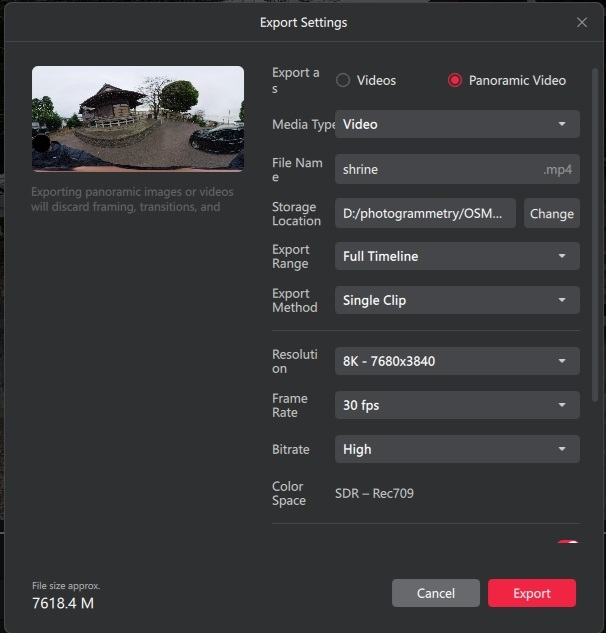
# Extract Still Images from Video
* There are many ways to extract still images from video. Research and choose your preferred method.
Here I introduce the tool I have published.
**Extract Sharpest Frame** is a tool that extracts the sharpest image at specified frame intervals.
* **New features are prioritized for updates in the BOOTH edition**
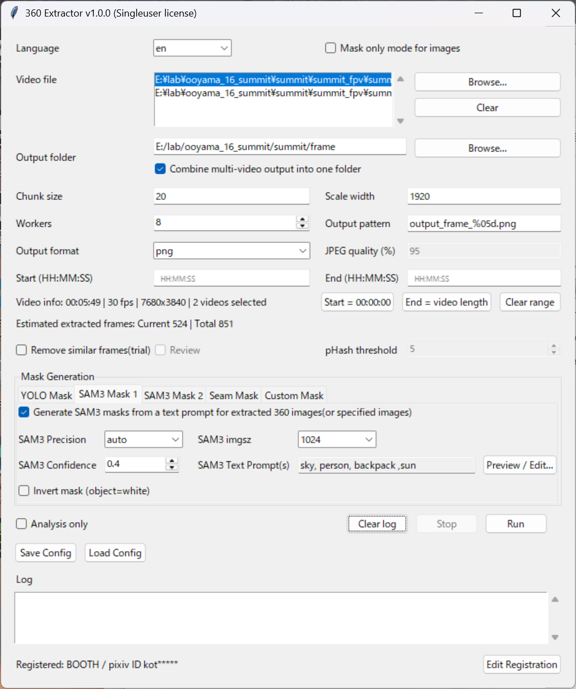

| Main Item | Description |
|---|---|
| Video file | Select the omnidirectional video. Multiple videos can be selected and processed in a batch. <small>Note: File paths containing multibyte characters are not supported.</small> |
| Output folder | Specify the folder where still images and masks will be saved. `frames` and `masks` folders will be created under this folder. You can also choose whether images extracted from multiple videos should be collected into a single folder. <small>Note: File paths containing multibyte characters are not supported.</small> |
| Scale width | Image size used when calculating sharpness for all video frames. Larger values give more precise calculations. Note: Extracted images are always output at the original video resolution. |
| Chunk size | Interval for extracting still images. For a 30 fps video, setting 30 extracts images every 1 second. Starting with a 1-second interval is recommended. |
| Workers | Number of concurrent extraction processes. Increase it according to your CPU core count. |
| Start (HH:MM:SS) | Specify the time to start extraction. The format is HH:MM:SS. <small>If left blank, processing starts from the beginning of the video.</small> |
| End (HH:MM:SS) | Specify the time to end extraction. The format is HH:MM:SS. <small>If left blank, processing continues to the end of the video.</small> |
| Remove similar frames | Excludes similar frames. If Review is enabled, you can adjust the threshold during execution to control how many images are extracted. |
| pHash threshold | Specifies the threshold for judging similar frames. Higher values remove more images. This is useful when movement speed during shooting is irregular. |
| Mask Generation | Generates mask images for objects such as people and cars. This improves SfM accuracy in later steps. |
| SAM3 Dual Mask | The latest version supports SAM3 masks. You can generate masks using any short sentence, and preview the result with the Preview/Edit button. 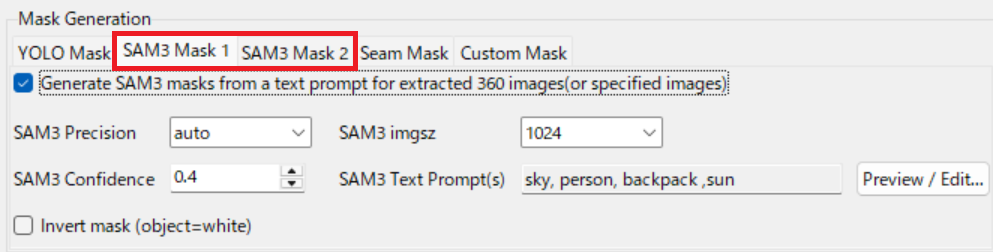 https://x.com/kotohibi_3d/status/2061044432837972367 (Advanced settings) SAM3 can be configured with two types of masks: one for camera alignment and one for 3DGS training. For details, see the following Google Slides: https://t.co/X0uRH959RV (The example uses Metashape, but the same concept applies to COLMAP.) |
| YOLO Mask | [YOLO Class IDs] Specify the class IDs to detect. 0: person, 1: bicycle, 2: car, etc. Multiple IDs can be specified comma-separated. https://github.com/ultralytics/ultralytics/blob/main/ultralytics/cfg/datasets/coco.yaml [YOLO Confidence] Raising the threshold reduces false positives. Lowering it detects more objects but increases false positives. [YOLO Model] Model size and performance increase from yolo11n toward yolo11x, but so does processing load. 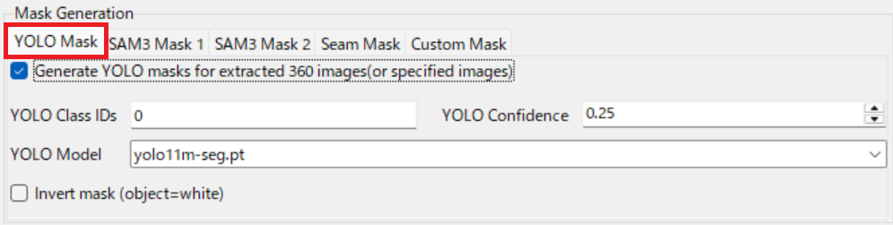 |
| Seam Mask | Masks misalignments along the stitch line joining the two fisheye images. To keep the stitch line fixed, develop the video with horizon-leveling features in DJI Studio, Insta360 Studio, and similar software turned off before using this feature. 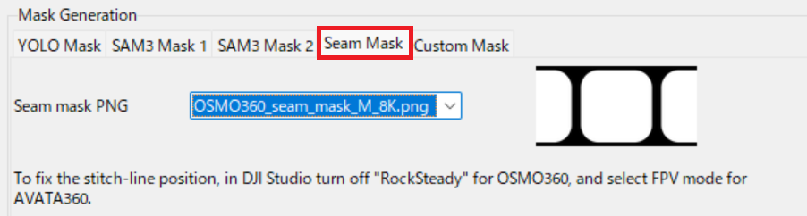 |
| Custom Mask | Specify a fixed mask image. When used with the masks above, they are merged. This is useful for masking areas that are always visible, such as a camera rig. <small>Note: Specify a PNG image with the same resolution as the video.</small>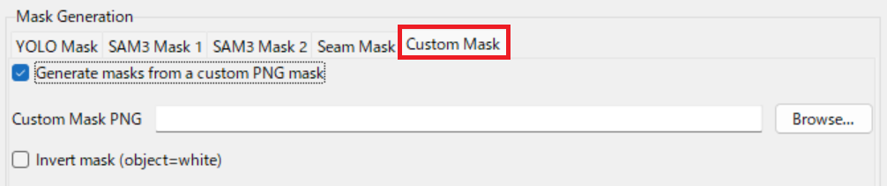 |
| Analysis only | Perform only sharpness calculation. Calculation results (metadata) are saved in the output folder. On subsequent runs, if metadata exists in the output folder, the analysis phase is skipped and only image extraction is performed. Useful when adjusting Chunk size. |
| Save config | Save the above settings as a configuration file. |
| Load config | Load a previously saved configuration file. |
| Run | Execute processing |

### Execution Result
* Still images are extracted as shown below. If the SfM in the next step fails, try reducing the still-image extraction interval.
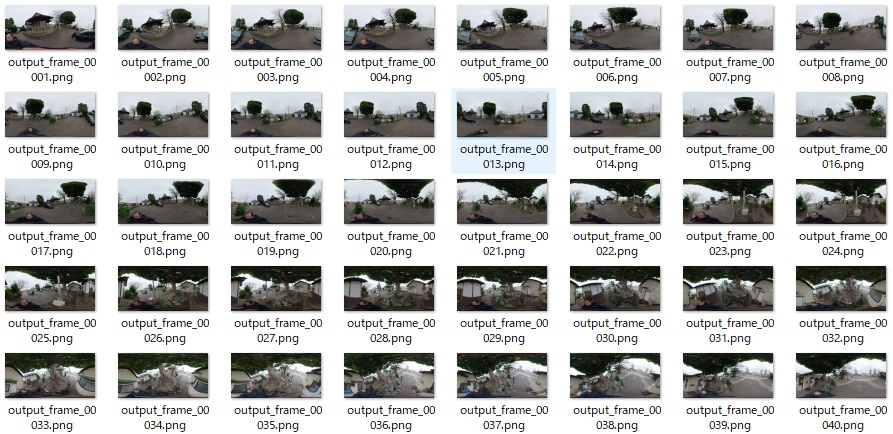
* Masks are also generated automatically (SAM3 + Seam mask example)
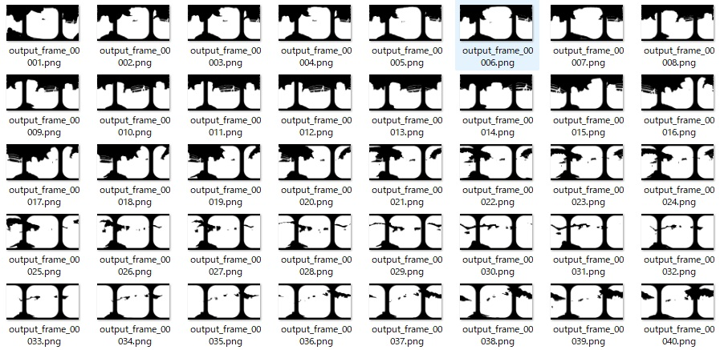

# Perform Camera Alignment (SfM)
* Extract colmap-x64-windows-cuda.zip into any folder and run **COLMAP.bat**.
### Create a Database and Specify the Image Files
* After running COLMAP.bat, the GUI starts.
* Select [File] -> [New Project], and the following dialog is displayed.
  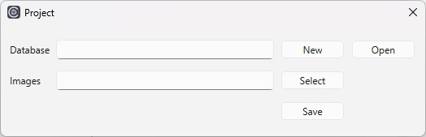
  | Item | Description |
  |---|---|
  | Database | Click the [New] button to create a new database file in an arbitrary location. Intermediate processing data is stored in this file. |
  | Images | Specify the folder containing the still images extracted from the video. |
  | Save | Finally, click the [Save] button to close the dialog. |

### Extract Features from the Images
* Select [Processing]->[Feature extraction] from the main window, and the following dialog is displayed.
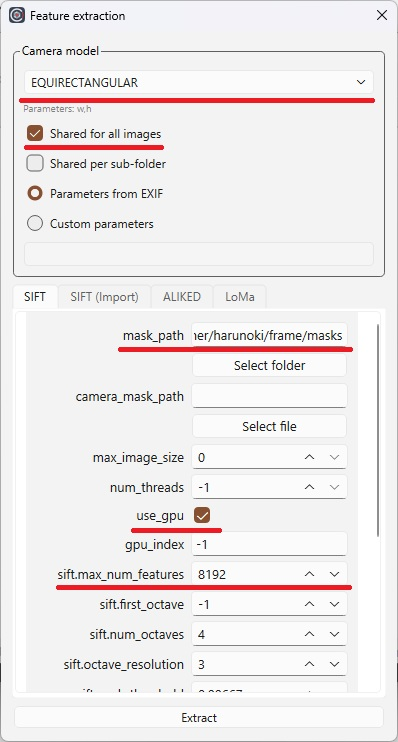
  | Item | Description |
  |---|---|
  | Camera model | Select EQUIRECTANGULAR. |
  | Shared for all images | Turn ON. |
  | mask_path | Specify the created masks for camera alignment. |
  | use_gpu | Turn ON. |
  | sift.max_num_features | The default value of 8192 is also fine, but increasing it increases the initial point cloud for 3DGS training and makes training more stable. If you are using a high-spec PC, try increasing it 2–3x (or more). |
  | Extract | Starts feature extraction. |

### Run Feature Matching
* Select [Processing]->[Feature matching] from the main window, and the following dialog is displayed.
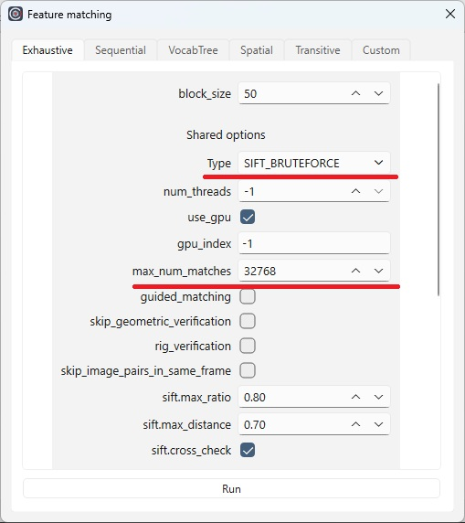
  | Item | Description |
  |---|---|
  | Type | In this guide, select the most basic SIFT_BRUTEFORCE. COLMAP allows you to choose from various feature matching algorithms. I would like to cover them in another article. |
  | max_num_matches | The default value of 32768 is also fine, but increasing it increases the initial point cloud for 3DGS training and makes training more stable. If you are using a high-spec PC, try increasing it 2–3x (or more). |
  | Run | Starts feature matching. |

### Run Camera Alignment
* Select [Reconstruction]->[Start reconstruction] from the main window to start camera alignment.
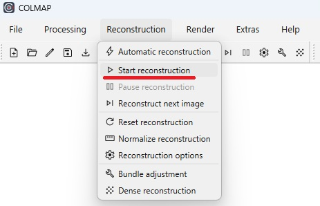

### Check the Camera Alignment Result
* When processing completes successfully, you will get a result like the one below. Check that the camera positions (spherical markers) are as expected.
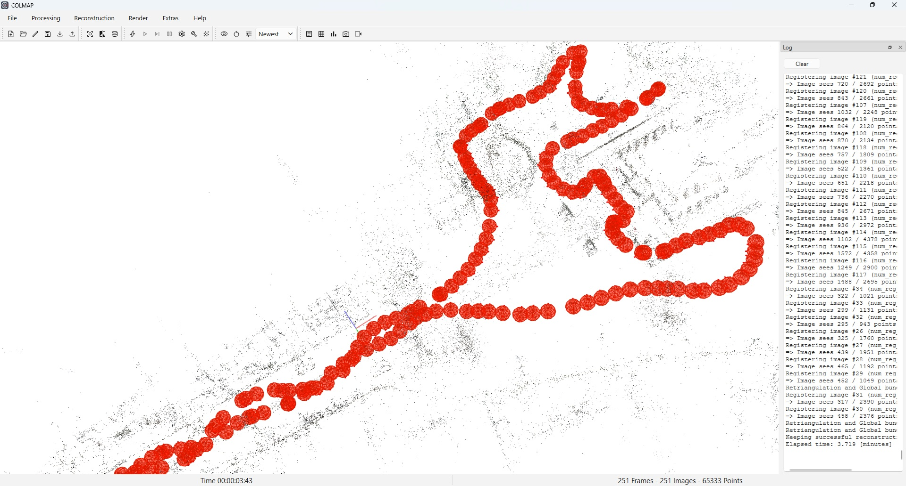

### Export the Camera Alignment Result
  * Select [File]->[Export model as text] from the main window to export the camera alignment information as text files.
  * The following files are output to the output folder.
  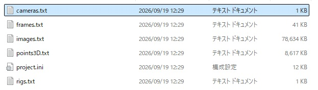

# Convert to Cubemap
* Expand the COLMAP camera alignment results into 6-direction Cubemap images. 
Here I introduce the tool I have published: **360 CCConverter** 

### Settings 1
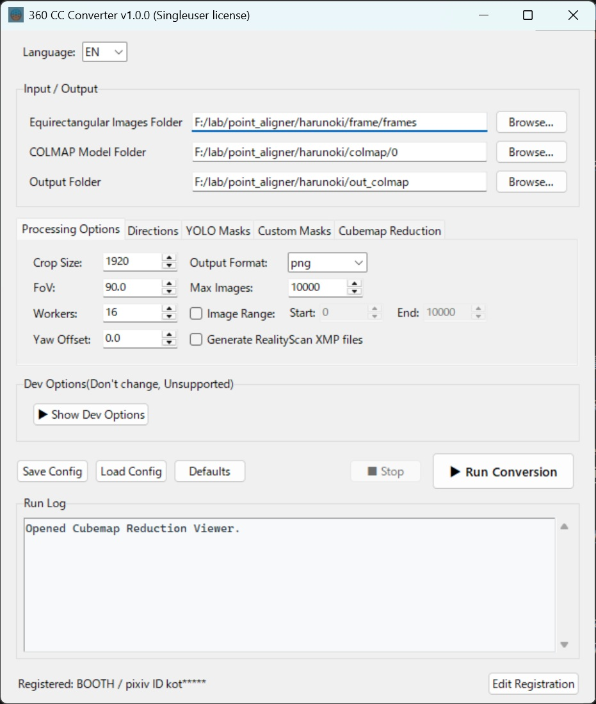

| Main Item | Description |
|---|---|
| Equirectangular Images Folder | Specify the folder containing the extracted omnidirectional images. <small>Note: File paths containing multibyte characters are not supported.</small> |
| COLMAP Model Folder | Specify the camera alignment output folder from COLMAP. <small>Note: File paths containing multibyte characters are not supported.</small> |
| Output Folder | Specify the folder where the Cubemap will be saved. <small>Note: File paths containing multibyte characters are not supported.</small> |
| Crop Size | Pixel size for the 6-direction crop. For OSMO360 8K video, 1920 is fine. |
| FoV | Field of view for the 6-direction crop. 90° is fine. |
| Max Images | Upper limit on the number of omnidirectional images to process. Use a small value when testing. |
| Image Range | Specify a range of omnidirectional images to process (useful for partial processing). |
| Workers | Number of processing threads. Adjust according to the number of CPU cores. |
| Yaw Offset | Add variation to the Cubemap Yaw angle. The specified angle is added to each Cubemap. 5–30° is recommended. |
| Save Config | Save the above settings as a config file. |
| Run Conversion | Start the Cubemap conversion process. |

### Settings 2: Mask Processing
* You can generate masks for people, vehicles, and other objects on the expanded Cubemap images.
* If you use SAM3 masks generated by Extract Sharpest Frame, specify them in the custom mask settings below. They can be combined with YOLO masks.
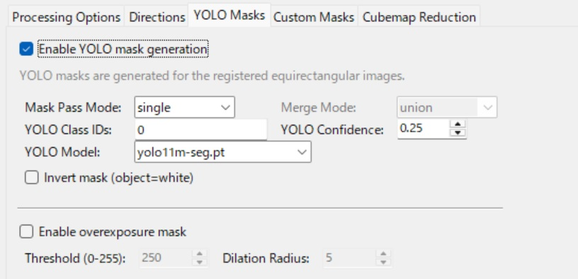

| Main Item | Description |
|---|---|
| Mask Pass Mode | Single: Detects objects only from the omnidirectional image (fast but lower accuracy). Dual: Uses both omnidirectional and Cubemap images for the detection (more processing but higher accuracy). |
| Merge Mode | Mode used when combining masks in Dual mode. "union" simply merges both; "refine" uses the Cubemap mask as the base and integrates the omnidirectional mask. "refine" is recommended. |
| YOLO Class IDs | Specify the class IDs to detect. 0: person, 1: bicycle, 2: car, etc. Multiple IDs can be specified comma-separated. https://github.com/ultralytics/ultralytics/blob/main/ultralytics/cfg/datasets/coco.yaml |
| YOLO Confidence | Lowering the threshold increases the detection rate but also increases noise. |
| Enable overexposure mask | Overexposed (blown-out) pixels can become noise during 3DGS training. Enable this if you want to remove them. |

### Settings 3 (Advanced Settings): Custom Mask
* You can load SAM3 Dual Masks (for 3DGS training) generated by Extract Sharpest Frame, or any custom masks. Specify mask images as PNG files with the same count, resolution, and filenames as the still images. Reference: Google Slides -> https://t.co/X0uRH959RV (The example uses Metashape, but the same concept applies to COLMAP.) 
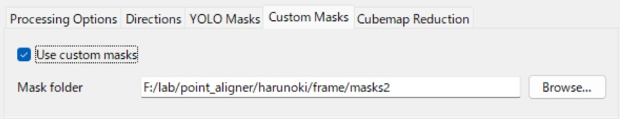

### Settings 4 (Advanced Settings): Cubemap Reduction
* This feature reduces the number of Cubemaps while minimizing 3DGS quality loss. It can shorten 3DGS training time and reduce VRAM usage.
* The ZIP file downloaded from BOOTH includes a detailed PDF operation manual. Please refer to it.
* Reference: https://x.com/kotohibi_3d/status/2078671971639009313
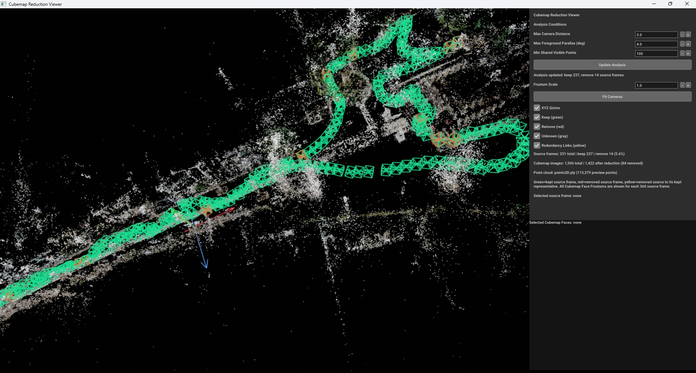

### Execute
* After processing completes successfully, the following folders and files are generated in the output folder. 

# (LichtFeld Studio) 3D Gaussian Splatting Training
Here I explain the workflow using LichtFeld Studio (LFS) V0.5.3.
### Import Cubemap
* Select [File]-> [Import Dataset], then specify the `Output Folder` from CCConverter. 

* If the data is detected correctly, a dialog like the one below appears. Confirm the contents and click [Load] to continue. 
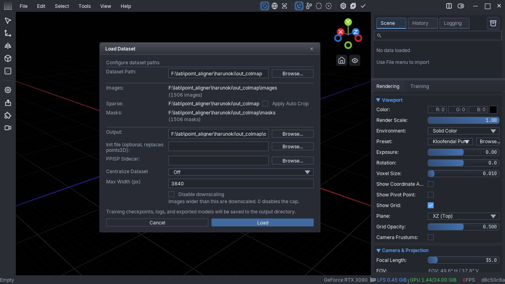

* Once the data is loaded correctly, you will see a screen like the one below. 
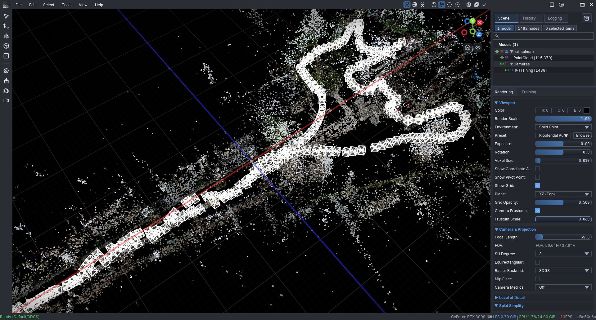

### Start 3DGS Training
* Mask settings
  * Select [Training Parameters]->[Mask Mode]->[Ignore].
  * Turn off [Alpha Mask].
* Training parameters
  * Here is an example of the settings I often use.
  * I recommend [Strategy]->[MRNF] (at the time this article was written).
  * Adjust `Max Gaussians` according to the scale of the scene (3,000,000–12,000,000).
  * Adjust `SH Degree` (1–3). If VRAM is limited, I recommend 1.
  * `Iterations` and `Steps Scaler` are calculated automatically according to the number of images.
  * With MRNF, changes to the other parameters are usually not very necessary.
  * LFS has many parameters, so please research on the web and find the best settings for your scene.
  * Note: Recently, Bilateral Grid is often turned off (PPISP is sufficient in many cases).
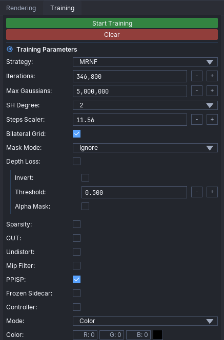

* Click [Start Training] to begin 3DGS training.

### 3DGS Training Result
* As training progresses, you should start seeing the 3DGS!
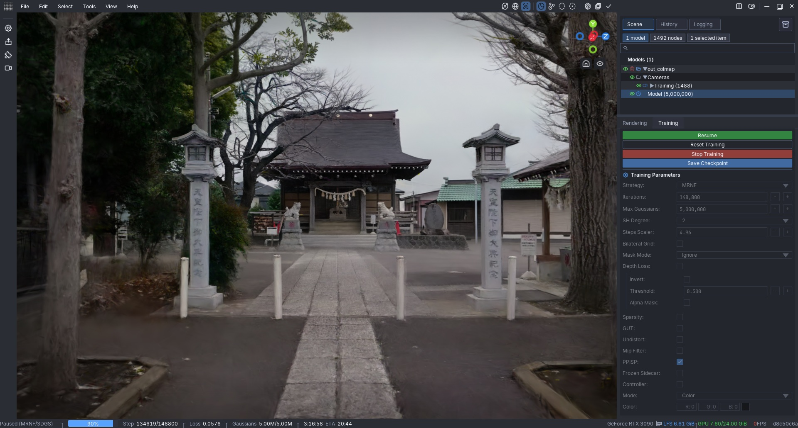

# Finally
There are many 3DGS methods, and this article is just one example. I will continue sharing the latest information on my X account.
Please research on your own and develop even better techniques. Enjoy 3DGS :)
* my 360 Tools: https://kotohibi.f5.si/360
* my X: https://x.com/kotohibi_3d
* 3DGS pipeline guide: https://github.com/Kotohibi/3DGS_pipeline_guide
