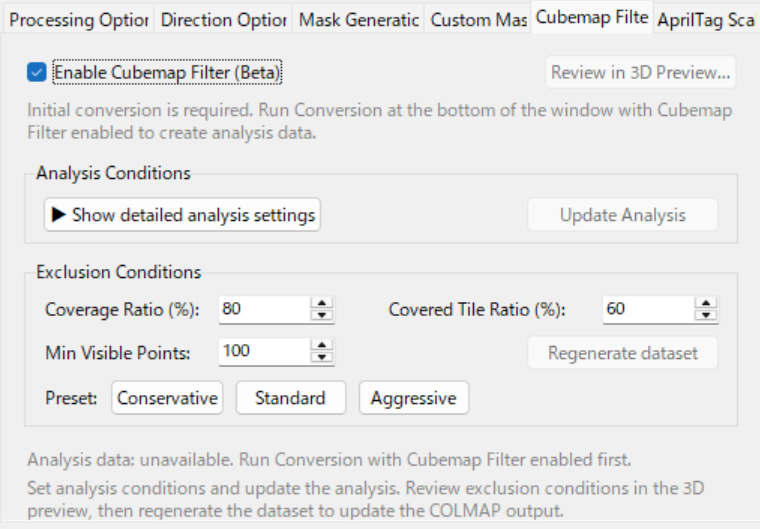

# Introduction
This document is intended for users who:
* Understand the following guide:
  * [[EN]Easy&Fast 3D Gaussian Splatting workflow with 360 Camera]([EN]Easy&Fast%203D%20Gaussian%20Splatting%20workflow%20with%20360%20Camera.md)
* Have a general understanding of the 3DGS production workflow using a 360 camera
* Want to take the next step and create higher-quality 3DGS results
  

# Overview
Creating 3DGS with 360 cameras such as OSMO360 or AVATA360 is easy, but there are limits in terms of quality. On the other hand, workflows using planar images from mirrorless cameras and similar devices can achieve higher quality, but they require more shooting effort and make it difficult to reconstruct the entire scene.
This workflow proposes a mixed workflow using both a 360 camera and a planar camera.
The main goal is to improve 3DGS results by capturing the entire scene with a 360 camera while capturing the area of interest in detail with a planar camera.

# References

# Requirements

* 360 camera
  * DJI OSMO 360
  * DJI AVATA 360
  * Insta 360
  * etc...
* Planar camera
  * Mirrorless camera
  * Action camera
  * etc... 

* High-end PC and NVIDIA GPU
    * Training 3DGS requires a high-performance GPU. In particular, more VRAM is better. I recommend a GPU with at least 12 GB of VRAM.
* Metashape Standard (Professional edition is not supported)
    * Directly supports SfM with 360 images; extremely fast and robust.
    * https://www.agisoft.com/features/standard-edition/

* 3D Gaussian Splatting software
    * Postshot: https://www.jawset.com/
    * LichtFeld Studio (LFS): https://github.com/MrNeRF/LichtFeld-Studio
    * Brush: https://github.com/ArthurBrussee/brush
* Still-image extraction tool from video
    * Extract Sharpest Frame (also known as 360 Extractor)
        * https://github.com/Kotohibi/Extract_sharpest_frame
        * BOOTH Windows Binary Edition: https://kotohibi-cg.booth.pm/
* Metashape 360 SfM to COLMAP-format Cubemap conversion tool
    * Metashape 360 to COLMAP Converter (also known as 360 MCConverter)
        * https://github.com/Kotohibi/Metashape_360_to_COLMAP_plane
        * BOOTH Windows Binary Edition: https://kotohibi-cg.booth.pm/

* (Optional) Additional license for estimating real-world scale in 3DCG
    * Metashape 360 to COLMAP Converter includes a feature that estimates the real-world scale of 3DGS using a 2D marker called AprilTag. An additional license is required to use it. The following articles explain how to use AprilTag.
    * Add-on Real Scale 3DGS with AprilTag https://kotohibi-cg.booth.pm/items/8323677
    * English version: https://x.gd/CoWJA
    * Japanese version: https://x.gd/Isahb

# How This Guide Explains the Procedure
The following sections mainly explain the processing flow. For detailed tool usage and option descriptions, refer to the following guide:
*  [[EN]Easy&Fast 3D Gaussian Splatting workflow with 360 Camera]([EN]Easy&Fast%203D%20Gaussian%20Splatting%20workflow%20with%20360%20Camera.md)

# Preparing Videos and Still Images
This article explains 3DGS production using the following video materials as an example. 
**I strongly recommend matching exposure and color tone between the 360 camera and planar camera in development software beforehand.
If exposure and color tone differ significantly, the 3DGS result will be worse.**

|Camera type|Device|Format|Purpose|
|---|---|---|---|
|360 camera|Insta 360 X3|Video|Reconstructing the entire scene|
|Planar camera|Drone-mounted camera|Video|Reconstructing the area of interest|

# Extracting Still Images and Generating Masks from 360 Video
There are many ways to extract still images from video. Research and choose your preferred method.
Here I introduce the tool I have published.
**Extract Sharpest Frame** is a tool that extracts the sharpest image at specified frame intervals.
**New features are prioritized for updates in the BOOTH edition**

## Preparing a Custom Mask (Optional)
In this example, the 360 camera is mounted under a drone, so the drone body appears in the upper half of the image. In such cases, create an image that masks the upper half and register it as a custom mask.
The specified custom mask is automatically merged with YOLO and SAM3 masks.
The custom mask must have the same image size as the original video.
If you are using a drone with a built-in 360 camera such as DJI AVATA360, this step is not necessary.

|Image|Custom mask|
|---|---|
|||

## Loading the Video
Load the 360 video in Extract Sharpest Frame. This tool can batch-process multiple videos.
* If you turn on the "collect outputs from multiple videos into one folder" option, a sequential prefix is added to each video file, and the extracted still images are stored in one folder. Masks are also stored in one folder in the same way.
  * Example still-image filenames when processing two video files
    * Video 1 | Mask: 001_[output filename pattern], ...
    * Video 2 | Mask: 002_[output filename pattern], ...
* The still-image extraction settings are shared. If you want to extract each video file with different conditions, run the extraction process multiple times.
* In that case, by using the same Output folder and changing the Output pattern, you can avoid overwriting extracted files and collect them into the same folder.
* You can limit the target timecode with "Start" and "End", which is useful for test runs.

## SAM3 Mask Settings
This tool can configure two types of SAM3 masks.
The "SAM3 Mask 1" and "SAM3 Mask 2" tabs correspond to this feature.
By separating masks for camera alignment and masks for 3DGS training, you can generate higher-quality 3DGS.
|Purpose|Description|Example mask prompt|Mask example|
|---|---|---|---|
|Camera alignment|Mask moving objects as much as possible|sky, cloud, tree, vehicle, drone, people||
|3DGS training|Mask only the minimum necessary moving objects|drone, people||

# Extracting Still Images and Generating Masks from Planar Video
Next, extract still images and generate masks from the planar video. The method is the same as for the 360 video.
In this article, the planar video is treated as a single file from a drone-mounted camera.
Because the still images and masks should be collected into the same folder as the 360 processing results, specify the same output folder.
**Also, to avoid overwriting files, change the [Output filename pattern] to a non-overlapping name as shown below.** 

|Output filename pattern|
|---|
|`003_output_frame_%05d.png`|

## Tips
Extract Sharpest Frame can create masks not only from videos, but also from still images.
In that case, turn on the following [Still Image Mask Mode] and select the still-image folder.

## Folder Structure
After still-image extraction and mask generation, the folder structure is as follows.

|Folder name / filename|Description|
|---|---|
|_batch_metadata|Temporary folder used when processing multiple videos|
|frames|Folder containing still images extracted from both 360 video and planar video|
|masks|Mask folder for Metashape camera alignment|
|masks2|Mask folder used during 3DGS training|
|_sharpness_metadata.csv|Metadata file generated after analyzing video frames|

# Performing Camera Alignment
Next, perform camera alignment using Metashape Standard.
Metashape can align still images extracted from both 360 video and planar video at once.

## Loading Still Images
* Select [Workflow] -> [Add Folder], then specify the "frames" folder above and load the extracted still images. 

## Changing Camera Type
* Select [Tools] -> [Camera Calibration]. 

If the 360 images and planar images are loaded correctly, they are automatically separated into two image groups.
Set "Camera type" to "Spherical" and "Frame" respectively.
|360 images|Planar images|
|---|---|
|||

## Running Camera Alignment
* Run it from [Workflow] -> [Align Photos].
### SfM Parameter Settings
Here are two parameter examples I often use.

|Example|Description|
|------|------|
||Turn ON "Generic preselection." It first matches photos at a low-precision setting, selects overlapping pairs, and then runs the main process. This is fast, but it can fail in some cases. If that happens, try the option below. For [**Apply masks to**], select [**Key points**].|
||Turn OFF "Generic preselection." This performs full matching for all image pairs. Since it takes longer, set "Key point limit" to a smaller value. Set "Tie point limit" to 0 for unlimited points. For [**Apply masks to**], select [**Key points**].|

## Checking the Result
If camera alignment succeeds, a result containing both 360 and planar images is displayed as shown below. 

### Cleaning Up Tie points
* Remove low-reliability Tie points to improve SfM accuracy.
This is a very important step for high-detail 3DGS.
Select [Tools] -> [Tie Points] -> [Clean Tie points]. 

* Select [Reprojection error] and adjust the slider to remove about 5% of the Tie points. 

* The number of Tie points is shown at the bottom left of the screen, so adjust the slider while checking how many Tie points will be removed. 

* Click [Optimize Cameras] to optimize the cameras. 

* Do the same for [Reconstruction uncertainty], remove about 5% of the Tie points, and then run [Optimize Cameras] again.

* Do the same for [Projection accuracy], remove about 5% of the Tie points, and then run [Optimize Cameras] again.

* Repeat the above once more so that low-reliability Tie points are removed in the final state.

### Exporting SfM Results
  * Export Camera information
      Select [File] -> [Export] -> [Export Cameras], choose Agisoft XML (*.xml), and save.
  * Export Point Cloud
      Select [File] -> [Export] -> [Export Point Cloud], choose Stanford PLY (*.ply), and save.

# Converting to COLMAP Cubemap
* Expand the Metashape SfM results into COLMAP-format 6-direction Cubemap images.
Here I introduce the tool I have published.
**Metashape 360 to COLMAP Converter**
* **New features are prioritized for updates in the BOOTH edition**

The basic usage is the same as in the guide below, but this time the 3DGS training masks generated earlier are used for Cubemap expansion.
*  [[EN]Easy&Fast 3D Gaussian Splatting workflow with 360 Camera]([EN]Easy&Fast%203D%20Gaussian%20Splatting%20workflow%20with%20360%20Camera.md)

## Setting a Custom Mask
From the Custom Mask tab, set the folder path of the 3DGS training masks generated during still-image extraction.

## Running the Conversion
Press "Run Conversion" to start processing.
At this point, a dialog appears indicating that planar images are included, but press "OK" to continue processing.
360 images are expanded into Cubemaps, while planar images are automatically undistorted using the pinhole model. Masks are also processed automatically in the same way.

## Advanced
Starting with **Metashape 360 to COLMAP Converter V1.2.0**, a Cubemap Filter has been implemented. It detects overlap between Cubemaps expanded from 360 images and planar images, and can exclude the corresponding Cubemap faces. This increases the frequency with which the target area is trained from planar images, making it possible to improve the overall quality of 3DGS. For details, refer to the PDF included in the tool zip file.
See my post on X: https://x.com/kotohibi_3d/status/2078088377371681237

* When "Cubemap Filter" is turned ON, overlapping Cubemap regions are excluded.

 
* Result after excluding Cubemap faces.

# Training 3DGS
Because the usage is the same as below, detailed steps are omitted.
*  [[EN]Easy&Fast 3D Gaussian Splatting workflow with 360 Camera]([EN]Easy&Fast%203D%20Gaussian%20Splatting%20workflow%20with%20360%20Camera.md)

## Checking the COLMAP Dataset Loading Result
|Postshot|LichtFeld Studio|
|---|---|
|||

## 3DGS Training Result
As shown below, the quality of the area of interest captured with the planar camera improved.
|Planar images only|360 images + planar images|
|---|---|
|||

See my post on X: https://x.com/kotohibi_3d/status/2048060928579850578

## Discussion
|Combination|Quality|
|---|---|
|Planar images only|The 3DGS quality of the area of interest is the best. Reconstructing the entire scene requires a very large amount of effort.|
|360 images + planar images|The 3DGS quality is between "planar images only" and "360 images only." By capturing the entire scene with a 360 camera and the area of interest with a planar camera, this workflow achieves a good balance.|
|360 images only|This is the most efficient way to reconstruct the entire scene, but the reproducibility of the area of interest is not high.|

