# はじめに
本資料は以下のユーザーを対象にしています。
* 以下の手順書を理解している
  * [[JP]Easy&Fast 3D Gaussian Splatting workflow with 360 Camera]([JP]Easy&Fast%203D%20Gaussian%20Splatting%20workflow%20with%20360%20Camera.md)
* 全天球カメラを用いた3DGSの制作フローを一通り理解している
* さらにステップアップして高品位な3DGSを制作したい
  

# 概要
OSMO360やAVATA360等の全天球カメラを用いた3DGS制作は手軽な反面、品質面には限界がありました。一方、ミラーレスカメラ等の平面画像を用いたワークフローは品質が高いものの、撮影の手間が大きく、シーン全体の再現が難しいという課題がありました。
本ワークフローは全天球カメラと平面カメラを用いた混合ワークフローを提案するものです。
シーン全体を全天球カメラで撮影し、注目領域は平面カメラで精緻に撮影して3DGSの結果を向上させることを主眼に置きます。

# 参考

# 必要な物

* 全天球カメラ
  * DJI OSMO 360
  * DJI AVATA 360
  * Insta 360
  * etc...
* 平面カメラ
  * ミラーレスカメラ
  * アクションカム
  * etc... 

* ハイエンドPCとNVIDIA GPU
    * 3DGSの学習には高性能なGPUが必要になります。特にVRAMは多い方が良いです。最低でも12GB以上のVRAMを搭載したGPUを推奨します。
* Metashape Standard (Professional版は未サポート)
    * 全天球画像を直接SfM可能で、非常に高速&ロバストです
    * https://www.agisoft.com/features/standard-edition/

* 3D Gaussian Splatting software
    * Postshot: https://www.jawset.com/
    * LichtFeld Studio(LFS): https://github.com/MrNeRF/LichtFeld-Studio
    * Brush: https://github.com/ArthurBrussee/brush
* 動画から静止画切り出しツール
    * Extract Sharpest Frame (別名:360 Extractor)
        * https://github.com/Kotohibi/Extract_sharpest_frame
        * BOOTH版 Windows Binary Edition: https://kotohibi-cg.booth.pm/
* Metashape 360 SfMからCOLMAP形式のCubemap変換ツール
    * Metashape 360 to COLMAP Converter (別名:360 MCConverter)
        * https://github.com/Kotohibi/Metashape_360_to_COLMAP_plane
        * BOOTH版 Windows Binary Edition: https://kotohibi-cg.booth.pm/

* (任意) 3DCGの実寸を推定するための追加ライセンス
    * Metashape 360 to COLMAP ConverterはAprilTagという二次元マーカーを利用して、3DGSの実寸を推定する機能があります。利用には追加ライセンスが必要です。AprilTagの利用方法は以下の記事で説明しています。
    * Add-on Real Scale 3DGS with AprilTag https://kotohibi-cg.booth.pm/items/8323677
    * 英語版 : https://x.gd/CoWJA
    * 日本語版 : https://x.gd/Isahb

# 手順の説明方法について
以降の手順では、処理フローをメインに解説します。ツールの細かい使い方やオプション詳細については、以下の手順書を参考にしてください。
*  [[JP]Easy&Fast 3D Gaussian Splatting workflow with 360 Camera]([JP]Easy&Fast%203D%20Gaussian%20Splatting%20workflow%20with%20360%20Camera.md)
# 動画、静止画の準備
本記事では以下の映像素材を例に、3DGS制作を解説します。 
**事前に全天球カメラと平面カメラ間の露出や色調は現像ソフト等で合わせておくことを強く推奨します。
露出、色調が大きく異なる場合、3DGSの結果は悪化します。**

|カメラタイプ|機種|形式|目的|
|---|---|---|---|
|全天球カメラ|Insta 360 X3|動画|シーン全体の再現用|
|平面カメラ|ドローン搭載カメラ|動画|注目領域の再現用|

# 全天球動画から静止画抽出とマスク生成
動画から静止画を切り出す方法は様々あります。お好きな方法を調査、選択してください。
ここでは私が公開しているツールをご紹介します。
**Extract Sharpest Frame**は指定フレーム間隔で一番シャープな画像を切り出すツールです。
**新機能はBOOTH版を優先的にアップデートしております**

## カスタムマスクの準備（任意）
本事例では、全天球カメラがドローン下部にマウントされているため、上半分にドローン機体が映り込みます。このような場合は上半分をマスクした画像を作成し、カスタムマスクに登録します。
指定したカスタムマスクはYOLOやSAM3マスクに自動で融合されます。
カスタムマスクはオリジナル動画と同じ画サイズである必要があります。
DJI AVATA360等の全天球カメラ搭載ドローンを使用する場合は、この手順は不要です。

|画像|カスタムマスク|
|---|---|
|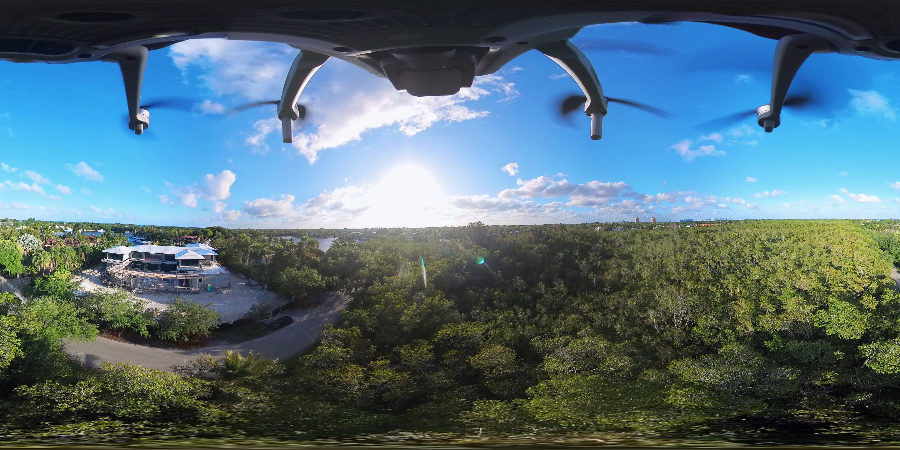|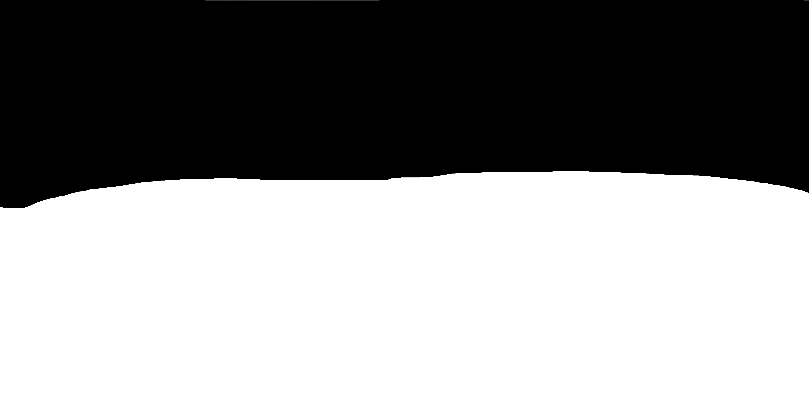|

## 動画を読み込む
Extract Sharpest Frameで全天球動画を読み込みます。本ツールは複数動画をバッチ処理可能です。
* "複数動画の出力を1つのフォルダにまとめる"オプションをオンにすると、動画ファイルごとに連番の接頭辞が付与され、静止画が抽出されて1つのフォルダに格納されます。マスクも同様に1つのフォルダに格納されます。
  * 2つの動画ファイル処理時の静止画ファイル名例
    * 動画1|マスク : 001_[出力ファイル名パターン], ...
    * 動画2|マスク : 002_[出力ファイル名パターン], ...
* 静止画抽出設定は共通設定です。動画ファイルごとに異なる条件で抽出したい場合は、抽出処理を複数回に分けてください。
* その場合、Output folderを同一にして、Output patternを変えることで、抽出ファイルの上書き保存を回避でき、また同一フォルダにまとめることが可能です。
* "Start", "End"で処理対象のタイムコードを限定でき、テストランに有効です。
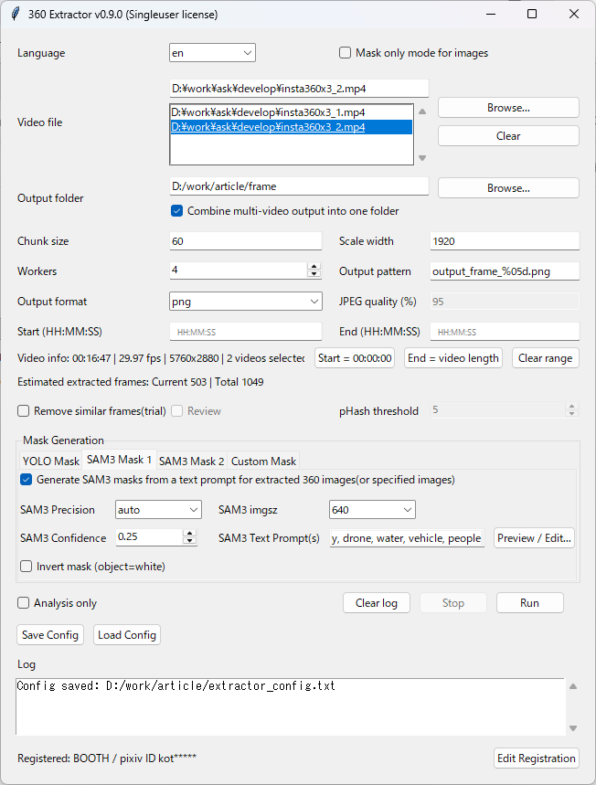

## SAM3マスク設定
本ツールは、二通りのSAM3マスク設定をすることが可能です。
"SAM3 Mask 1", "SAM3 Mask 2"タブがその機能に相当します。
カメラアラインメント用と3DGS学習用のマスクを分けることで高品質な3DGSを生成することができます。
|用途|説明|マスクプロンプト例|マスク例|
|---|---|---|---|
|カメラアラインメント|可能な限り動体をマスク|sky, cloud, tree, vehicle, drone, people|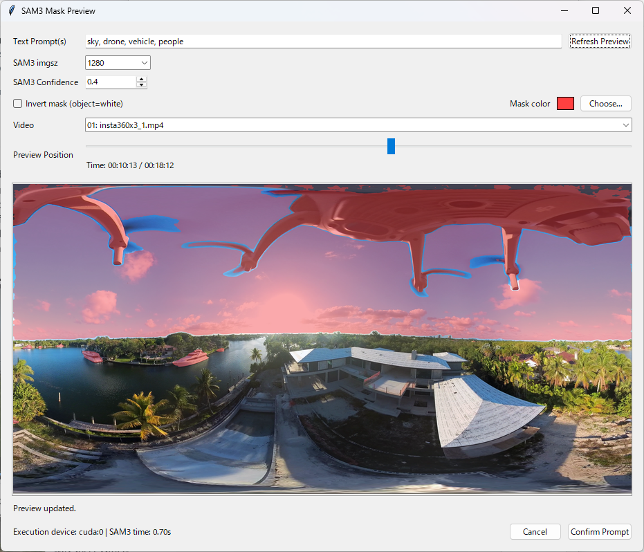|
|3DGS学習用|最低限の動体をマスク|drone, people|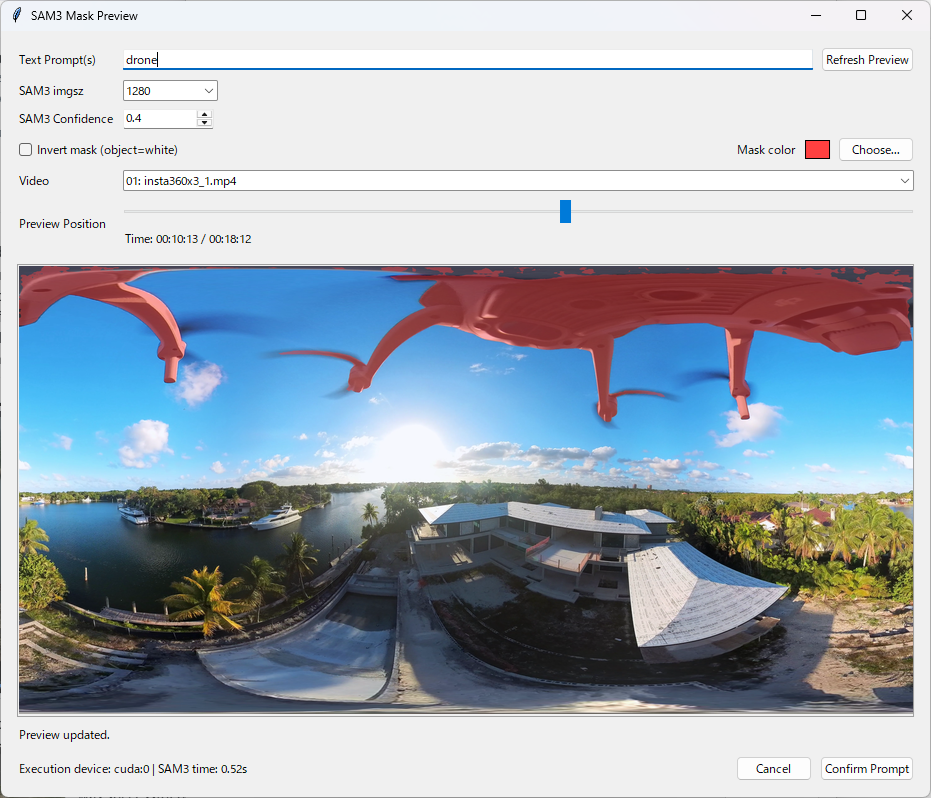|

# 平面動画から静止画抽出とマスク生成
次に平面動画から静止画抽出とマスク生成を行います。方法は全天球動画と同じ方法です。
本記事では平面動画はドローン搭載カメラで1ファイルとします。
静止画とマスクは全天球処理結果のフォルダにまとめたいため、同じ出力フォルダを指定します。
**また上書き保存を避けるため、[出力ファイル名パターン]を以下のように被らない名前へ変更します。** 

|出力ファイル名パターン|
|---|
|`003_output_frame_%05d.png`|

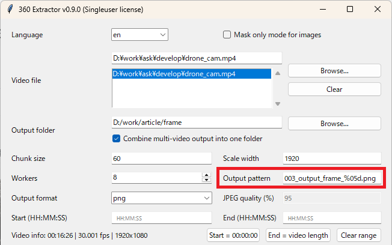

## Tips
Extract Sharpest Frameは動画だけでなく、静止画からマスクを作成することも可能です。
その場合は以下の[静止画マスクモード]をオンにして、静止画フォルダを選択してください。
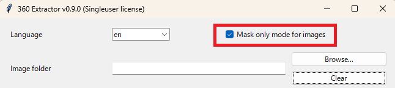

## フォルダ構造
静止画抽出とマスク生成後のフォルダ構造は以下になります。

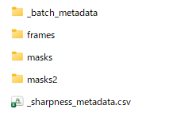
|フォルダ名, ファイル名|説明|
|---|---|
|_batch_metadata|複数動画処理時の一時フォルダ|
|frames|全天球動画と平面動画から抽出した静止画がまとまったフォルダ|
|masks|Metashapeのカメラアラインメント用のマスクフォルダ|
|masks2|3DGS学習時に使うマスクフォルダ|
|_sharpness_metadata.csv|動画フレームを解析後にできるメタデータファイル|

# カメラアラインメントする
次にMetashape Standardを用いてカメラアラインメントします。
Metashapeでは、全天球動画と平面動画から抽出した静止画を一度にカメラアラインメントすることが可能です。

## 静止画を読み込む
* [Workflow]->[Add Folder]で上記の"frames"フォルダを指定して抽出した静止画を読み込みます。 
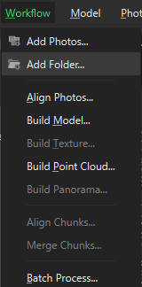

## カメラタイプを変更する
* [Tools]->[Camera Calibration]を選択します。 
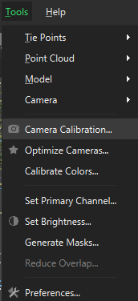

全天球画像と平面画像が正常に読み込まれていると、二つの画像グループに自動で分かれます。
"Camera type"をそれぞれ"Spherical"と"Frame"に設定します。
|全天球画像|平面画像|
|---|---|
|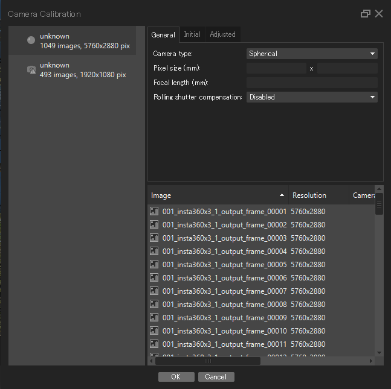|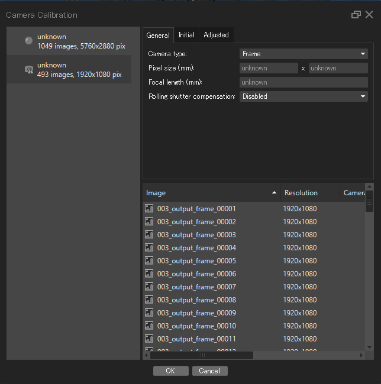|

## カメラアラインメントを実行する
* [Workflow]->[Align Photos]より実行します。
### SfMのパラメータ設定
私がよく使うパラメータ2例を示します。

|例|説明|
|------|------|
||"Generic preselection"をONにします。低精度設定でまず写真のマッチングを行い、重なり合うペアを選択してから本処理を行います。高速ですが失敗することがあります。その場合は下を試してみてください。[**Apply masks to**]は[**Key points**]を選択します。|
|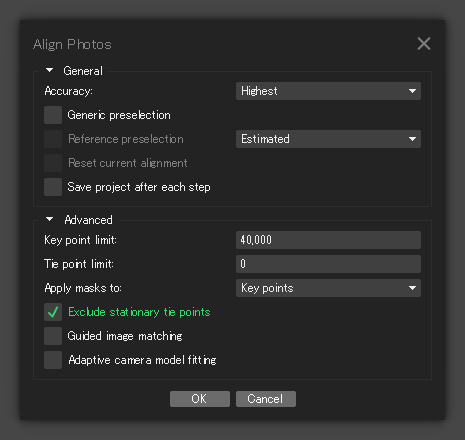|"Generic preselection"をOFFにします。すべての画像ペアをフルにマッチングさせます。処理に時間がかかるので、"Key point limit"は小さくします。"Tie point limit"は0にして無制限にします。[**Apply masks to**]は[**Key points**]を選択します。|

## 結果の確認
カメラアラインメントが成功すると以下のように、全天球と平面画像が混在した結果が表示されます。 
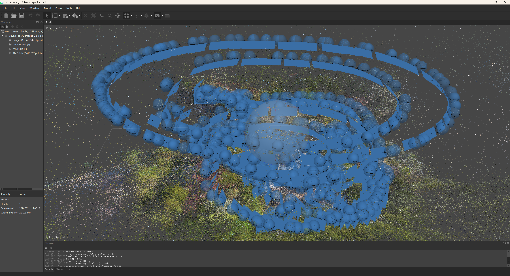

### Tie pointsのクリーンアップ
* 信頼性の低いTie pointsを削除して、SfMの精度を上げます。
これは高精細な3DGSにおいてとても重要な作業になります。
[Tools]->[Tie Points]->[Clean Tie points]を選択します 

* [Reprojection error]を選択してスライダーを調整して5%程度のTie pointsを削除するのがお勧めです 

* 画面左下にTie points数が表示されるので、削除対象のTie points数を確認しながらスライダーを調整してください 

* [Optimize Cameras]を押して、カメラの最適化を行います 

* [Reconstruction uncertainty]も同様に5%程度のTie pointsを削除して、再度[Optimize Cameras]を行います

* [Projection accuracy]も同様に5%程度のTie pointsを削除して、再度[Optimize Cameras]を行います

* 上記をもう一度繰り返して、最終的に信頼性の低いTie pointsが削除されている状態にします

### SfM結果のエクスポート
  * Camera情報のエクスポート
      [File]->[Export]->[Export Cameras]でAgisoft XML(*.xml)を選択して保存します。
  * Point Cloudのエクスポート
      [File]->[Export]->[Export Point Cloud]でStanford PLY(*.ply) を選択して保存します。

# COLMAP Cubemapに変換する
* MetashapeのSfM結果からCOLMAP形式の6方向画像のCubemapに展開します。
ここでは私が公開しているツールをご紹介します。
**Metashape 360 to COLMAP Converter**
* **新機能はBOOTH版を優先的にアップデートしております**

基本的な使い方は以下内容と同じですが、今回は先に生成した3DGS学習用マスクを利用してCubemap展開します。
*  [[JP]Easy&Fast 3D Gaussian Splatting workflow with 360 Camera]([JP]Easy&Fast%203D%20Gaussian%20Splatting%20workflow%20with%20360%20Camera.md)

## カスタムマスクを設定する
Custom Maskタブから静止画抽出時に生成した3DGS学習用マスクのフォルダパスを設定します。
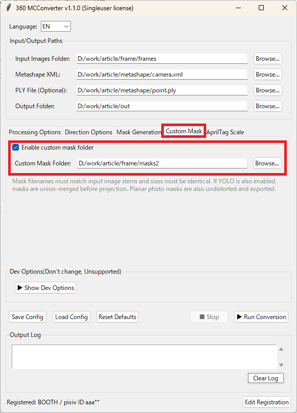

## 変換を実行する
"変換を実行"を押して処理を開始します。
この際に平面画像が混じっている旨のダイアログが表示されますが、"OK"ボタンを押して処理を継続します。
全天球画像はCubemap展開され、平面画像は自動でピンホールモデルにundistortionされます。マスクも同様に自動で処理されます。

# 3DGSを学習する
使い方は以下と同じなため、詳細な手順は省略します。
*  [[JP]Easy&Fast 3D Gaussian Splatting workflow with 360 Camera]([JP]Easy&Fast%203D%20Gaussian%20Splatting%20workflow%20with%20360%20Camera.md)

## COLMAPデータセットの読み込み結果の確認
|Postshot|LichtFeld Studio|
|---|---|
|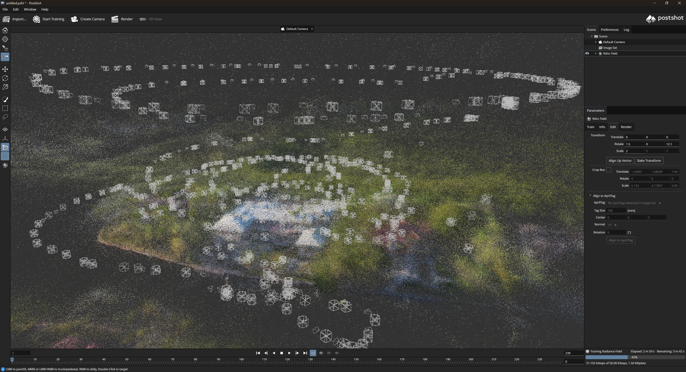|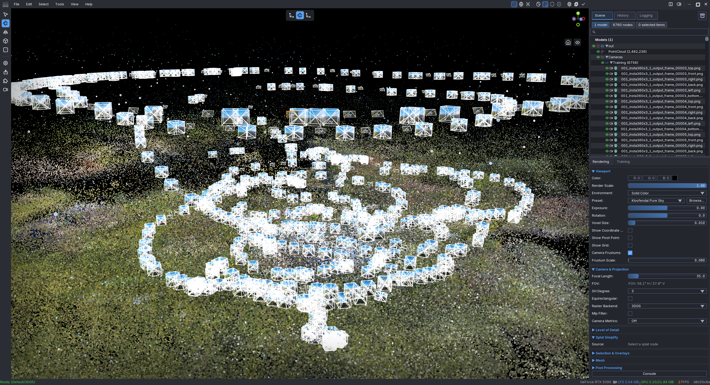|

## 3DGS学習結果
以下の通り、平面カメラで撮影した注目領域は品質が改善しました。
|平面画像のみ|全天球画像+平面画像|
|---|---|
|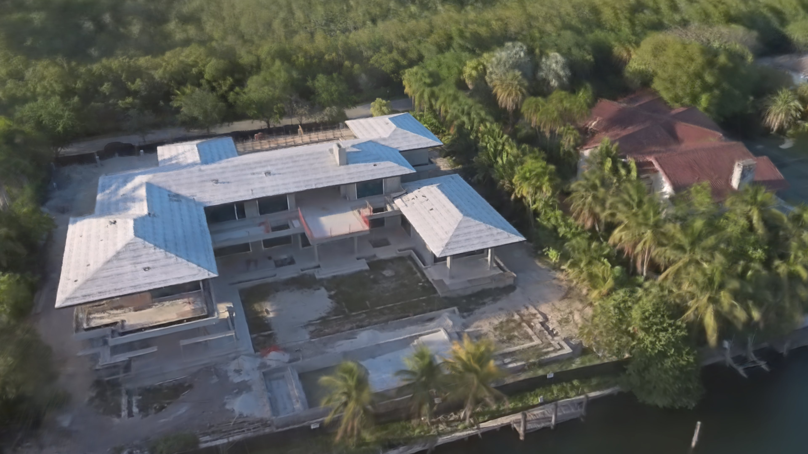|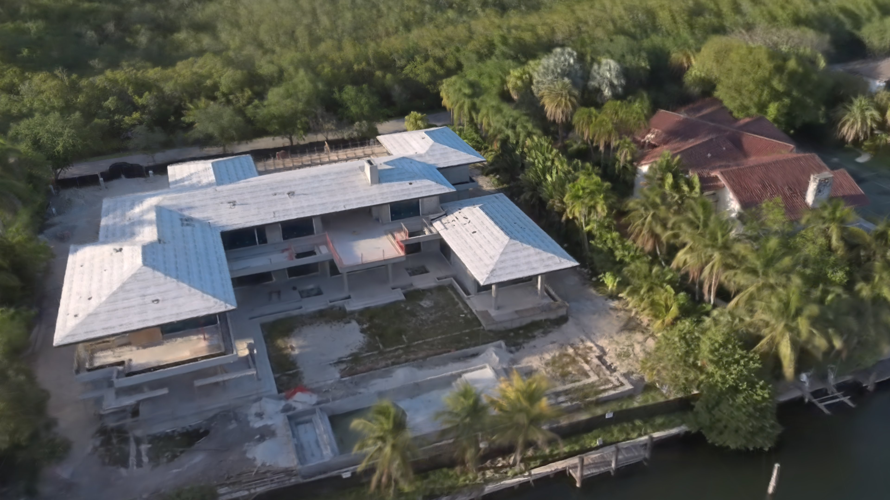|

See my post on X : https://x.com/kotohibi_3d/status/2048060928579850578

## 考察
|組み合わせ|品質|
|---|---|
|平面画像のみ|注目領域の3DGS品質は最も良い。シーン全体を再現するには非常に多くの労力が必要。|
|全天球画像+平面画像|3DGS品質は"平面画像のみ"と"全天球画像のみ"の中間の品質となる。シーン全体を全天球カメラで撮影し、注目領域を平面カメラで撮影することにより、バランスの取れたワークフローを実現できる。|
|全天球画像のみ|シーン全体の再現には最も効率が良いが、注目領域の再現性は高くない。|

## 今後の取り組み
全天球画像+平面画像の混合ワークフローによる品質劣化は全天球画像により引き起こされる。
よって、全天球画像と平面画像の重なりを検出して、全天球画像の面を除外することにより、
対象領域を高画質な平面画像で学習される頻度を上げ、3DGS全体の品質を引き上げることが可能と考えます。今後の開発に期待してください。 
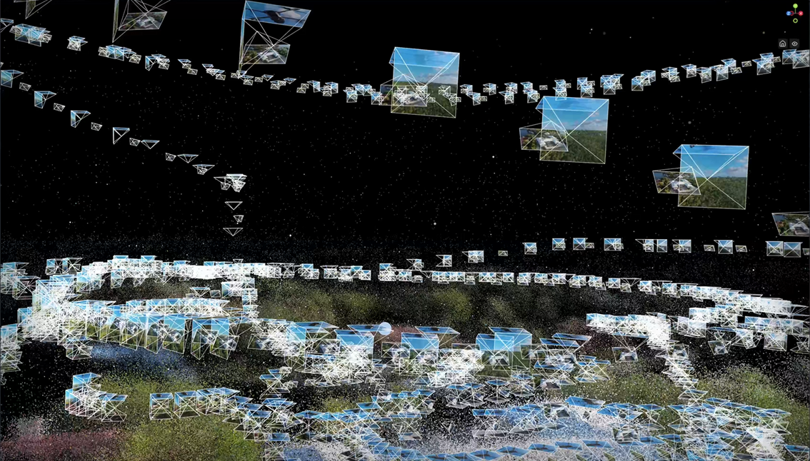

See my post on X : 
https://x.com/kotohibi_3d/status/2073597710977073526

